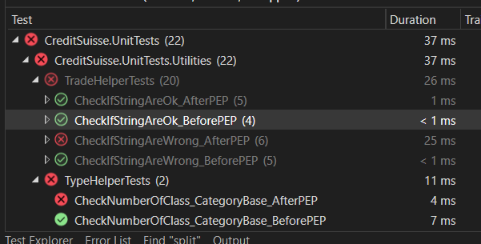

# Test of Bank Credit Suisse

----

## Questions

(1)

- The solution support data from keyboard and file;
- Using the file as input (included in this solution - testFile.txt) you need only input the reference date and the data of trades;
- Enum "Precedence" is used to setup the precedence of the categories;
- Case of the data of trades not match with none category, it will be ranked as "***NORANKED***"
- The solution has UnitTests.

	
(2)

- After include new property "IsPoliticallyExposed" in ITrade, Trade implement the new property and then,
	you must include the line in the Trade constructor:
	
```
 IsPoliticallyExposed = bool.Parse(dataOfTrade[3]);
```

----
	
## Observations

- You can test the application using the new category PEP, change some files:
	- Entities\Trade.cs - uncomment the lines 18 and 27
	- Enums\Precedence.cs - uncomment the line 8  
	- Entities\PEP.cs - uncomment all lines
	- CreditSuisse.Infrastructure project, Utilities\TradeHelper.cs - uncomment the lines 14 and 18 (extra validation)

- Here you can see the output of testFile.txt (testFile.txt.output.txt) before and after PEP:

| File Input                        |**Before PEP**       |**After PEP**      |
|-----------------------------------|---------------------|---------------------|
| 12/11/2020				 		|					|                   |
| 2000000 Private 12/29/2025 false	| `HIGHRISK`		| `HIGHRISK`        |
| 400000 Public 07/01/2020 false	| `EXPIRED`			| `EXPIRED`         |
| 5000000 Public 01/02/2024 false	| `MEDIUMRISK`		| `MEDIUMRISK`      |
| 3000000 Public 10/26/2023 false	| `MEDIUMRISK`		| `MEDIUMRISK`      |
| 300000 Public 10/26/2023 true		| `***NORANKED***` | `PEP`             |
| 2000000 Private 12/29/2025 true	| `HIGHRISK`		| `PEP`             |
| 300000 Public 10/26/2023 false	| `***NORANKED***` | `***NORANKED***` |
